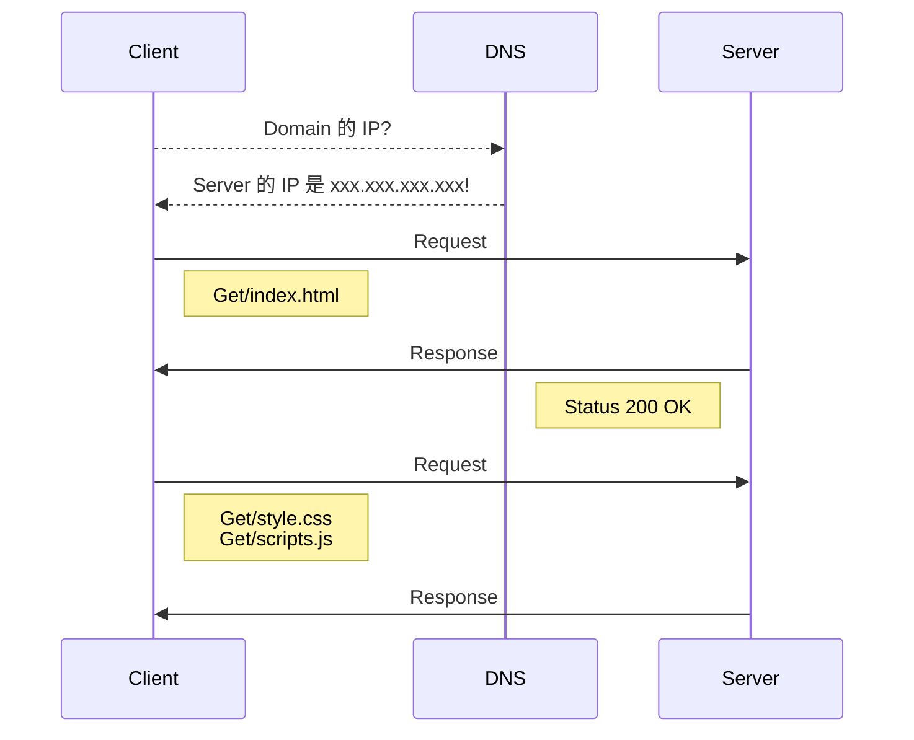

瀏覽器上所顯示的頁面資料是如何而來的?

當在瀏覽器輸入網址並送出後，到底發生了什麼事？

在了解之前先了解一下基本名詞。

## 基本名詞
- **IP** / **I**nternet **P**rotocol [#](https://zh.wikipedia.org/wiki/网际协议)
    >IP 定義了定址方法和資料報的封裝結構，任務僅僅是根據源主機和目的主機的位址來傳送資料。
    >IP 由 4 組 4 個數字組成，每組的範圍是 0 ~ 255。
- **Domain Name** / 域名 [#](https://zh.wikipedia.org/wiki/域名)
    >IP 位置是以沒有含意的數字組成  人類不好記憶，而域名可以視為 IP 地址的代稱，主要為了方便記憶。
- **DNS** / **D**omain **N**ame **S**ystem [#](https://zh.wikipedia.org/wiki/域名系统)
    >主要將方便記憶的 Domain Name 轉換為 Server 的 IP 位置。

## 粗略流程

流程如下：
1. 當瀏覽器(Client)送出網址後會先詢問 DNS Server 將域名轉換成 Server 的 IP 位置。
1. Client 會發送 request 給 Server 端。
1. Server 端解析 Request 後回傳 Response
1. Client 接收並解析 Response 、解析 .html 檔案。
1. 根據 .html 的內容，一旦發現有 CSS、JS 或 image 等檔案，會再發送個 Request 。
1. 開始下載需要的檔案（CSS、JS 或 image）。
1. 渲染網頁。